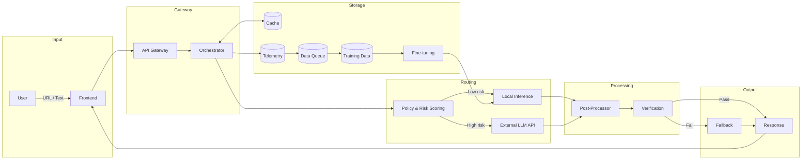

# Hybrid Architecture

This diagram shows the full processing pipeline with local inference, external API fallback, caching, and a feedback loop for continuous improvement.

## Component Details

### Policy & Risk Scoring
- PII/Compliance flags
- Domain detection (legal, health, financial)
- Length/complexity analysis
- Cross-language detection

### Local Inference Service
- mT5/ByT5 for simplification
- Optional local machine translation
- Lower latency, no API costs

### External LLM API
- Used for high-risk or complex cases
- Translate + simplify pipeline
- Fallback for edge cases

### Post-Processor / Rules Engine
- Sentence splitting
- Glossary expansions
- Bullet point formatting
- Max sentence length enforcement

### Verification & Safety Checks
- Numbers/dates preserved correctly
- Negation/modality preserved
- Language validation
- Toxicity/policy filters
- Optional semantic similarity check

### Fallback Strategy
- Retry with stricter prompt
- Switch between local ↔ API
- Return "could not safely simplify" message

### Cache
- Hash of (text, params)
- Store outputs + quality scores

### Telemetry / Observability
- Latency and cost tracking
- Model selection logging
- Evaluation scores
- User feedback collection

### Data Queue for Training
- Opted-in samples only
- Error cases for review
- Human review labels
- Feeds into fine-tuning pipeline
